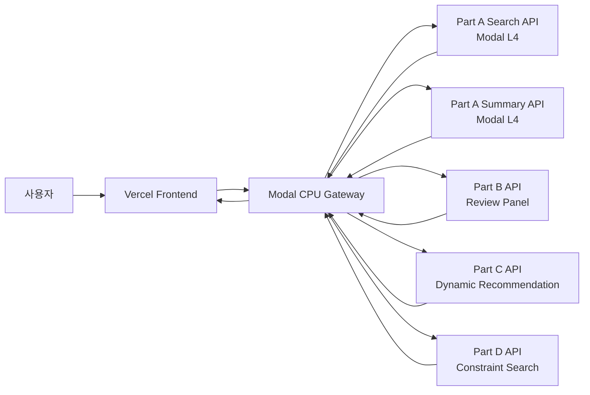

<h1 align="center">🎮 Steam Domain-Specific LLM</h1>

<h3 align="center">파인튜닝 소형 모델 기반 Steam 게임 검색·추천·분석 서비스</h3>

<p align="center">
  긴 게임 설명, 흩어진 리뷰, 근거가 부족한 추천, 복잡한 검색 조건을<br>
  네 개의 독립적인 도메인 특화 LLM 파이프라인으로 나누고 하나의 서비스로 연결합니다.
</p>

<p align="center">
  <a href="https://steam-domain-specific-llm.vercel.app/"><strong>라이브 데모</strong></a>
</p>

<p align="center">
  
  
  
  
</p>

## 1. 프로젝트 소개

Steam에는 약 14만 개 이상의 게임이 있지만, 사용자가 자신에게 맞는 게임을 찾기까지는 여전히 많은 정보 탐색이 필요합니다.

| 문제 | 사용자 불편 | 프로젝트의 접근 |
|---|---|---|
| 길고 마케팅성 표현이 많은 설명 | 실제 플레이가 무엇인지 빠르게 파악하기 어려움 | 핵심 정보를 고정 스키마로 요약 |
| 수많은 비정형 리뷰 | 장점과 불만의 공통 주제를 직접 읽어야 함 | 감성과 장단점 토픽을 구조화 |
| 추천 근거와 취향 맥락 부족 | 왜 지금 이 게임이 나에게 맞는지 알기 어려움 | 시간에 따라 변하는 성향과 추천 이유 제공 |
| 정형 필터 중심 검색 | “무료 멀티 공포 게임” 같은 요청을 바로 표현하기 어려움 | 자연어를 검색 조건으로 변환해 필터링·재정렬 |

이 프로젝트는 하나의 범용 모델에 모든 기능을 맡기지 않습니다. 같은 Steam 데이터 위에서 팀원 네 명이 각자 하나의 문제를 맡아 **데이터 구축 → 파인튜닝 → 평가 → API 서빙**까지 완주하고, 결과를 하나의 사용자 화면에서 연결합니다.

> 핵심 산출물은 단일 거대 모델이 아니라, 서로 독립적으로 학습·평가·배포할 수 있는 네 개의 도메인 특화 미니 파이프라인입니다.

## 2. 네 개의 도메인 태스크

| 파트 | 담당 | 태스크 | 사용자에게 제공하는 가치 | 통합 화면에서의 역할 |
|---|---|---|---|---|
| **A · 설명 요약** | 이정수 | 긴 게임 설명을 `장르 / 핵심플레이 / 특징`으로 요약 | “이 게임에서 무엇을 하는지” 빠르게 파악 | 일반 검색, 게임 설명 패널 |
| **B · 리뷰 분석** | 심현서 | 리뷰의 감성과 장단점 토픽을 분류·집계 | 사람들이 왜 좋아하고 불편해하는지 요약 | 리뷰 분석 패널 |
| **C · 동적 추천** | 유재현 | 최근 경험에 따라 변하는 사용자 성향과 추천 이유 생성 | 현재 취향에 맞는 게임과 그 근거 제공 | 개인화 추천, 추천 이유 카드 |
| **D · 조건 검색** | 성화섭 | 자연어에서 가격·장르·멀티플레이 등의 조건을 추출 | 복합 조건을 자연어 한 문장으로 검색 | 조건 검색, 조건 충족 근거 카드 |

각 파트의 모델, 데이터 구성과 평가 지표는 태스크 특성에 맞게 독립적으로 선택합니다.

## 3. 사용자 흐름

```text
자연어 질의 입력
→ A 일반 검색 / C 동적 추천 / D 조건 검색 중 모드 선택
→ 최대 30개 게임 검색 및 재정렬
→ 게임 선택
→ A 설명 요약 + B 리뷰 분석 패널 확인
```

- 검색 결과는 우선 10개를 보여주고 필요할 때 최대 30개까지 펼칩니다.
- C의 현재 성향과 게임별 추천 이유, D가 추출한 조건과 게임별 충족 근거는 검색 결과에서 바로 확인합니다.
- 패널은 파트별로 독립 로딩되어 한 서버가 느리거나 중단되어도 다른 결과를 먼저 볼 수 있습니다.
- 모든 데이터와 서비스는 Steam 원본 `appid`를 공통 연결 키로 사용합니다.

## 4. 전체 시스템 아키텍처



| 계층 | 역할 |
|---|---|
| **Frontend** | 검색 모드 선택, 결과 카드, 통합 게임 패널, 예열·fallback 상태 표시 |
| **CPU Gateway** | 파트별 요청 라우팅, `appid` 기반 결과 결합, 응답 형식 정규화 |
| **Part A/B/C/D API** | 각 담당자가 독립 배포한 검색·추천·분석 서버를 공통 JSON 계약으로 연결 |

게이트웨이는 모델 추론을 직접 수행하지 않는 얇은 오케스트레이션 계층입니다. 각 파트는 서로 다른 서버와 배포 주기를 유지하므로 한 파트의 장애가 전체 서비스 장애로 번지지 않도록 설계했습니다.

## 5. 데이터와 학습 원칙

공통 데이터는 **Steam Dataset 2025: Multi-Modal Gaming Analytics**를 사용합니다.

| 항목 | 내용 |
|---|---|
| 규모 | Steam 앱 239,664개, 이 중 게임 150,279개 · 검색 색인 약 14만 개 · 리뷰 1,048,148개 |
| 주요 데이터 | 게임 설명, 장르·카테고리·가격·플랫폼, 사용자 리뷰, 설명·리뷰 임베딩 |
| 공통 식별자 | Steam `appid` |
| 배포 형식 | PostgreSQL dump, CSV export, 임베딩 패키지, raw JSON sample |
| 라이선스 | CC BY 4.0 |

- 데이터 이해와 스키마: [Steam Dataset 2025 GitHub](https://github.com/vintagedon/steam-dataset-2025)
- 공식 데이터 배포: [Zenodo record 17266923](https://zenodo.org/records/17266923)

파트별 데이터는 각 태스크에 맞춰 중복·노이즈 제거, 형식 정규화, 개인정보 검토, Train/Validation/Test 분할을 수행합니다. 구체적인 데이터 구축 기준과 검수 방식은 파트별 문서에서 별도로 기록합니다.

## 6. 학습과 평가 방식

네 파트는 공통적으로 베이스라인과 파인튜닝 모델을 같은 test split에서 비교합니다. 단, 서로 다른 태스크를 하나의 점수로 억지로 묶지 않습니다.

| 태스크 | 주요 평가 관점 |
|---|---|
| A 설명 요약 | ROUGE, BERTScore, 사실성, 3필드 형식 준수율 |
| B 리뷰 분석 | Micro/Macro F1, Exact Match, JSON 형식 준수율 |
| C 동적 추천 | 추천 적합성, 설명의 근거성, 사용자 상태 변화 반영 |
| D 조건 검색 | 조건 추출 정확도, 검색 적합성, 하드 조건 준수율 |

파트 간 결과를 비교할 때는 최소한 다음 세 항목을 같은 형식으로 기록합니다.

1. 베이스라인 대비 파인튜닝 성능 변화
2. 출력 형식·유효성 준수율과 오류 사례
3. 실제 서빙 환경의 응답시간과 자원 사용량

## 7. 통합 API 계약

통합 화면은 각 파트의 내부 모델 구조를 강제하지 않고, 공개 HTTPS API와 `appid` 기반 응답만 공통 계약으로 사용합니다.

| 파트 | 주요 API | 통합 결과 |
|---|---|---|
| A | 일반 검색, 설명 요약 | 검색 목록, 게임 설명 패널 |
| B | `GET /panel` | 게임별 리뷰 감성·토픽 집계 |
| C | 행동 이벤트, `GET /search` | 사용자 상태를 반영한 추천 목록과 이유 |
| D | `GET /search` | 추출 조건, 조건 검색 결과와 충족 근거 |

요청 타임아웃, 예열과 fallback은 파트별로 독립 처리합니다. 한 서버가 준비 중이거나 응답하지 않더라도 다른 검색 결과와 패널은 먼저 표시할 수 있습니다.

## 8. 기술 구성

공통 통합 계층은 FastAPI 기반 CPU 게이트웨이와 HTML/CSS/JavaScript 프론트엔드로 구성되며 Vercel에서 공개합니다. 모델, 학습 방법과 추론 인프라는 각 태스크에 맞게 독립적으로 선택합니다.

| 파트 | 핵심 구현 |
|---|---|
| A | 키워드·의미 기반 검색, 구조화 게임 설명 요약 API |
| B | 리뷰 감성·토픽 분석, 게임 단위 집계 API |
| C | 행동 이력 기반 동적 추천, 사용자별 추천 이유 생성 |
| D | 자연어 조건 추출, 필터링·재정렬 검색 |

---

이 프로젝트는 완성된 추천 화면만을 목표로 하지 않습니다. 같은 도메인 데이터에서 서로 다른 태스크를 정의하고, 각자가 모델과 평가 기준을 선택해 실제 API로 배포한 과정 전체를 결과물로 봅니다.
